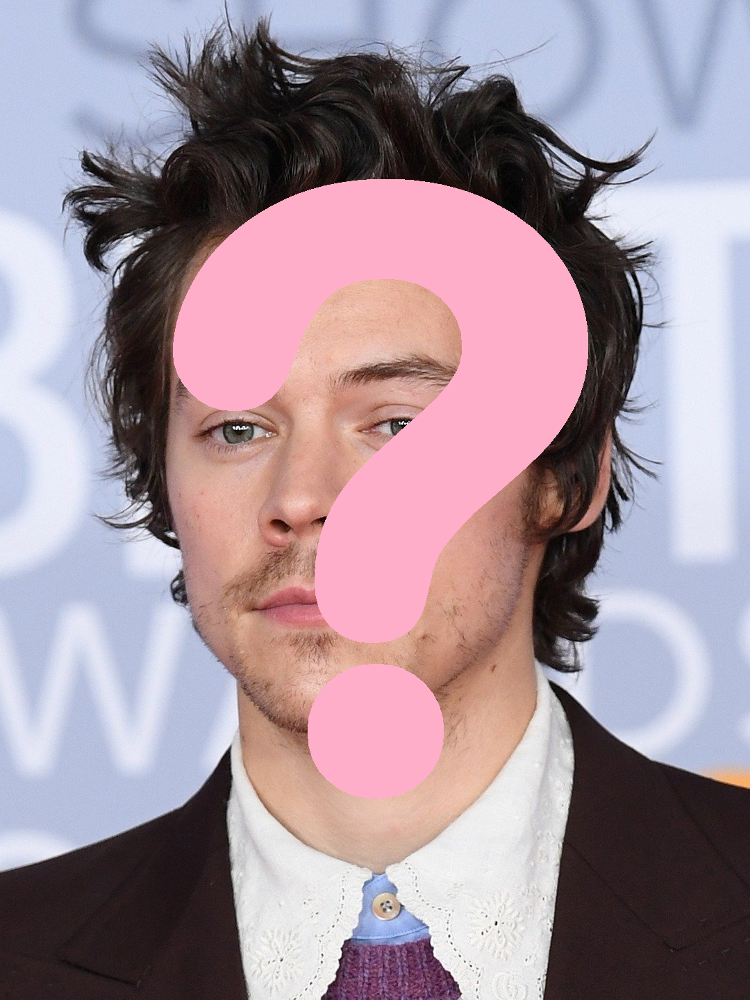

# Warm-Up: Query Styles
Read through the instructions, and try to uncover the many mysteries of the page...

## Introduction

  

    
  

  

    
This warm-up is all about creating a dynamic web experience through only a URL.

    
There is a URL below, with a <strong>question mark <code>?</code></strong> and some <strong>ampersands <code>&</code></strong>.
    
See if you can figure out how to change certain parts of the URL to update the page dynamically!
  

  

    
  

## The URL
<a href="https://querystyles.onrender.com?textColor=darkred&backgroundColor=cornsilk&font=comic%20sans%20ms&animal=dog&message=i%20like%20turtles&json=false">
  https://querystyles.onrender.com?textColor=darkred&backgroundColor=cornsilk&font=comic sans ms&animal=dog&message=i like turtles&json=false
</a>
