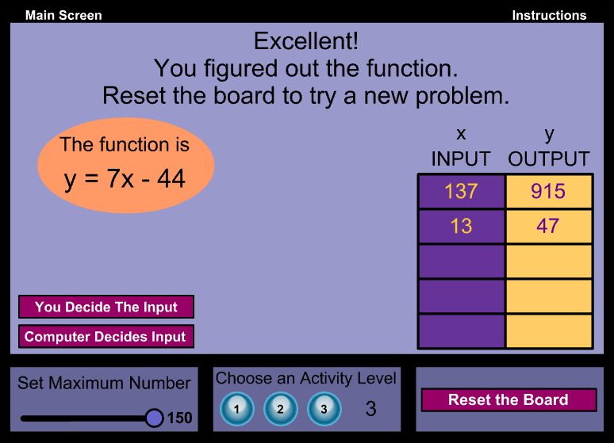

# Functions & Callbacks
Introduce [callbacks](https://www.w3schools.com/js/js_callback.asp) as a way to use functions as variables and parameters.

This lesson is fairly conceptual, and it may be difficult for students to grasp - however, using callbacks will become quite important when working with APIs.

## Warm-Up: Function Machine
Introduce the warm-up game by following the [instructions](WarmUp.md). Students will visit the [Function Machine](https://www.mathplayground.com/functionmachine.html) site, read through the instructions, and play the game. The first student to correctly figure out the answer for an Advanced Game, Activity Level 3, can win something. It should look something like this:

It may be worth walking through an example with the group just to show everyone how it works. There are also some additional games linked from the instructions - students are welcome to play those as well.

## Lecture: Functions & Callbacks
The [presentation](FunctionsAndCallbacks.pptx) reviews functions, and shows how they can be used for callbacks. There are a few code examples.

## Formative Assessment: Blooket
TODO

## Code-Along: TODO
Follow the [instructions](CodeAlong.md) to build up a website.

## Self-Paced Work: TODO
Have the students follow [the instructions](SelfPacedWork.md) to continue working on the website.

## Challenges
There are some additional [challenges](Challenges.md).
 
## Agenda

| Activity | Time |
|-|-|
| Warm-Up | 10m |
| Lecture | 20m |
| Formative Assessment | 15m |
| Break | 15m |
| Code-Along | 30m |
| Self-Paced Work/Challenges | 30m |
